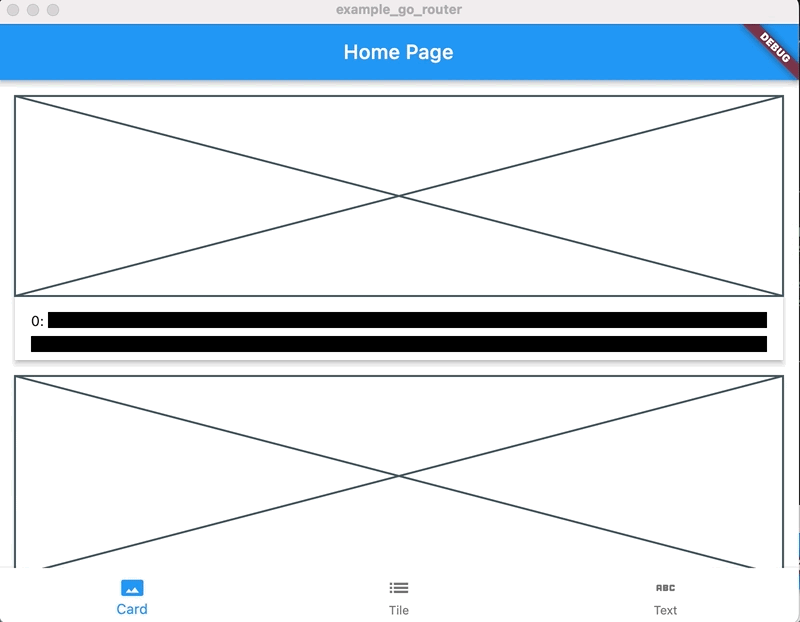

<!-- START doctoc generated TOC please keep comment here to allow auto update -->
<!-- DON'T EDIT THIS SECTION, INSTEAD RE-RUN doctoc TO UPDATE -->
**Table of Contents**

- [example_go_router](#example_go_router)

<!-- END doctoc generated TOC please keep comment here to allow auto update -->

# example_go_router

